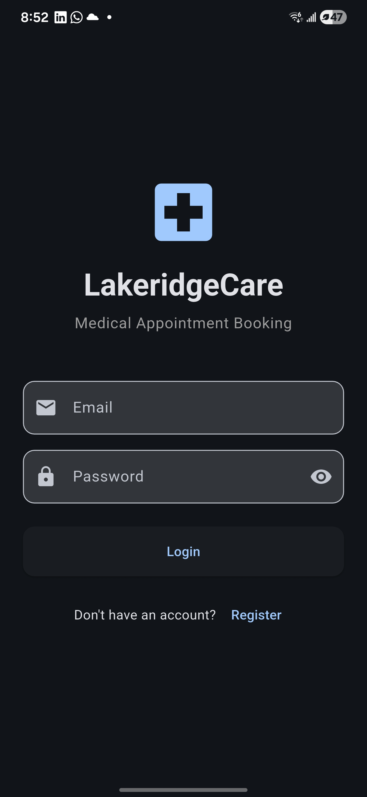
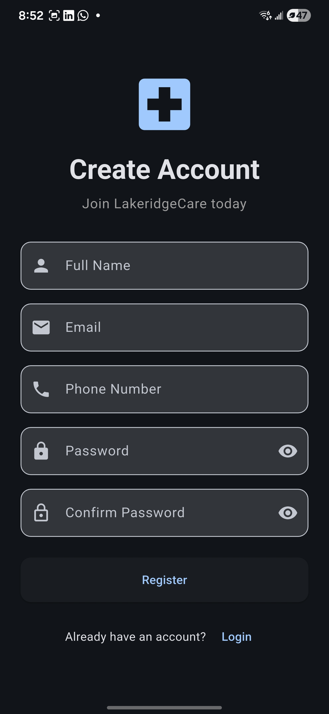
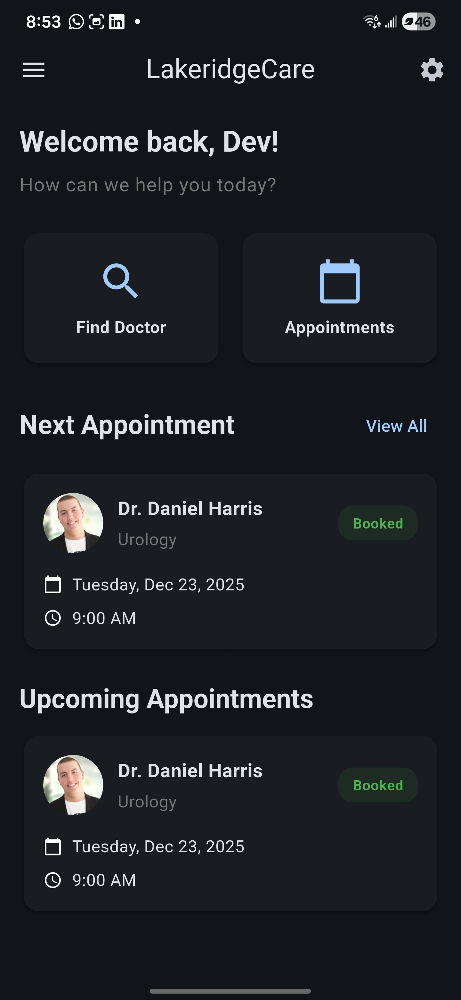
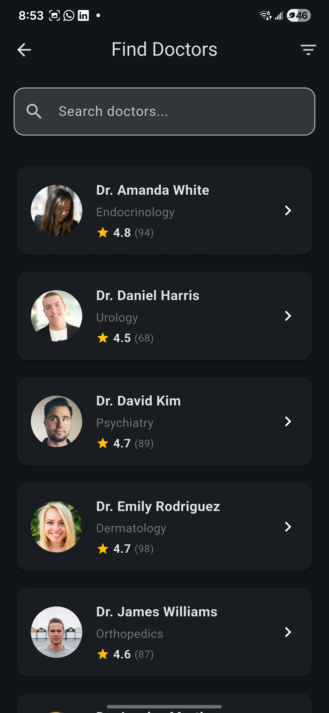
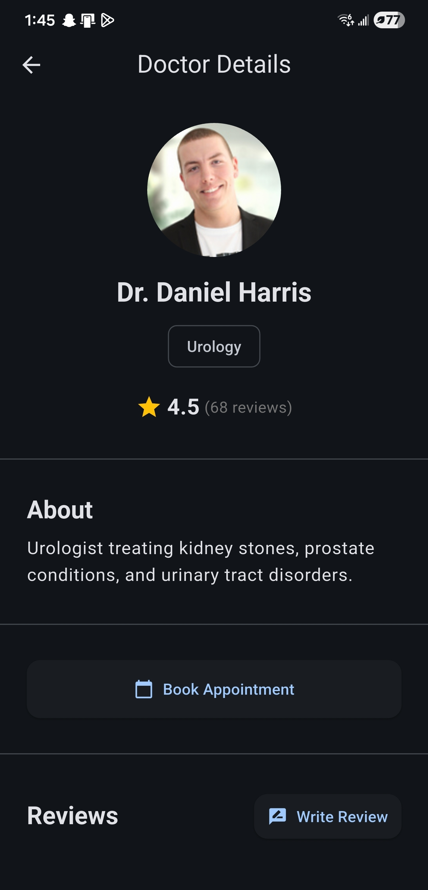
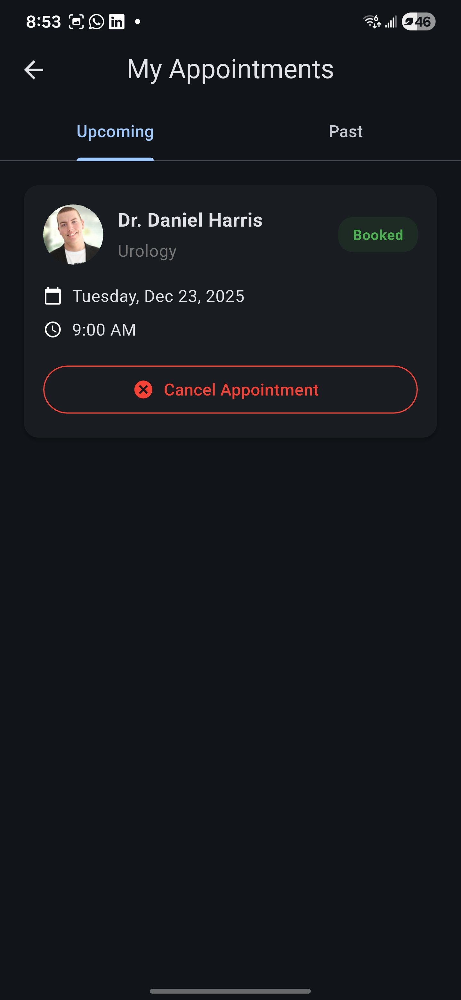
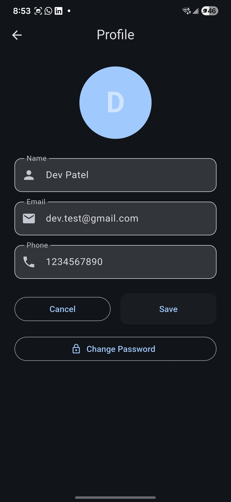
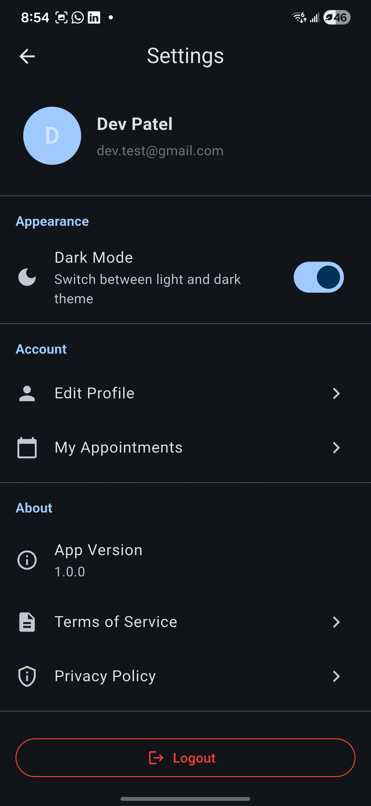

# LakeridgeCare – Medical Appointment Booking App

A Flutter mobile application for booking medical appointments at Lakeridge Hospital in Oshawa, Ontario.

## Project Overview

LakeridgeCare is a mobile appointment booking system built as a final project for **INFT-3101-02 Mobile Development** at Durham College. The app demonstrates practical skills in Flutter development, UI/UX design, RESTful API integration, and full-stack mobile application development.

**Built for:** Patients looking to book medical appointments with doctors at Lakeridge Hospital  
**Built by:** Group 15 – Dev Patel, Sai Trivedi, and Vaidehi Garge  
**Completed:** December 2025

This project showcases:

- Cross-platform mobile development using Flutter
- Backend API design with Node.js and Express
- Database management with MongoDB Atlas
- User authentication and authorization
- State management using Provider
- Real-time data fetching and updates

---

## Features

### Core Functionality

- **User Authentication**

  - Register new account with email and password
  - Login with credentials
  - JWT-based session management
  - Secure password storage (bcrypt hashing)

- **Doctor Discovery**

  - Browse all available doctors
  - Filter by medical department (Cardiology, Pediatrics, Dermatology, etc.)
  - Search doctors by name
  - View doctor ratings and reviews

- **Doctor Profiles**

  - Detailed doctor information (bio, specialization, department)
  - Average rating display
  - Patient reviews section

- **Appointment Booking**

  - Select available date and time slots
  - Book appointments with chosen doctor
  - Confirmation feedback

- **Appointment Management**

  - View upcoming appointments
  - View past appointments
  - Cancel appointments

- **User Profile**

  - Update personal information (name, phone, email)
  - View account details

- **Settings**
  - Toggle light/dark theme
  - Logout functionality

---

## App Screens

The application consists of the following main screens:

1. **Login Screen** – User authentication with email and password
2. **Register Screen** – New user account creation
3. **Home Screen** – Welcome message and upcoming appointment preview
4. **Doctor List Screen** – Browsable list of doctors with filtering options
5. **Doctor Details Screen** – Complete doctor profile with booking interface
6. **Appointments Screen** – View and manage all appointments
7. **Profile Screen** – User account information and editing
8. **Settings Screen** – Theme preferences and logout

---

## System Architecture

### Frontend (Flutter)

- **Framework:** Flutter SDK 3.0.0+
- **Language:** Dart
- **State Management:** Provider
- **HTTP Client:** http package
- **Secure Storage:** flutter_secure_storage (for JWT tokens)
- **UI Components:** Material Design

### Backend (Node.js + Express)

- **Runtime:** Node.js
- **Framework:** Express.js
- **Authentication:** JWT (jsonwebtoken)
- **Password Hashing:** bcrypt
- **Validation:** express-validator
- **Middleware:** CORS enabled for cross-origin requests

### Database

- **Database:** MongoDB Atlas (Cloud)
- **ODM:** Mongoose
- **Collections:** Users, Doctors, Appointments, Reviews

### Communication

- RESTful API architecture
- JSON data format
- Token-based authentication (Bearer tokens)

---

## Database Design

### Collections

#### 1. Users Collection

```
_id               : ObjectId (Primary Key)
name              : String
email             : String (unique)
phone             : String
password          : String (hashed)
theme             : String ('light' or 'dark')
createdAt         : Date
updatedAt         : Date
```

#### 2. Doctors Collection

```
_id               : ObjectId (Primary Key)
name              : String
department        : String
bio               : String
imageUrl          : String
ratingAvg         : Number (0-5)
ratingCount       : Number
createdAt         : Date
updatedAt         : Date
```

#### 3. Appointments Collection

```
_id               : ObjectId (Primary Key)
userId            : ObjectId (Foreign Key -> Users)
doctorId          : ObjectId (Foreign Key -> Doctors)
date              : String (YYYY-MM-DD)
time              : String (HH:mm)
status            : String ('booked', 'cancelled', 'completed')
createdAt         : Date
updatedAt         : Date
```

#### 4. Reviews Collection

```
_id               : ObjectId (Primary Key)
userId            : ObjectId (Foreign Key -> Users)
doctorId          : ObjectId (Foreign Key -> Doctors)
rating            : Number (1-5)
comment           : String
createdAt         : Date
updatedAt         : Date
```

### Relationships

- One User can have many Appointments
- One Doctor can have many Appointments
- One User can write many Reviews (for different doctors)
- One Doctor can have many Reviews
- Each User-Doctor pair can have only one Review (unique constraint)

---

## Setup & Installation Guide

### Prerequisites

Before running this project, ensure you have the following installed:

- **Flutter SDK** (version 3.0.0 or higher)

  - Download from: https://flutter.dev/docs/get-started/install
  - Verify: `flutter --version`

- **Dart SDK** (comes with Flutter)

  - Verify: `dart --version`

- **Node.js** (version 16.0 or higher)

  - Download from: https://nodejs.org/
  - Verify: `node --version`

- **npm** (comes with Node.js)

  - Verify: `npm --version`

- **MongoDB Atlas Account** (free tier)

  - Sign up at: https://www.mongodb.com/cloud/atlas

- **Android Studio / Xcode** (for emulator/simulator)
  - Android Studio for Android development
  - Xcode for iOS development (macOS only)

---

### Backend Setup

#### Step 1: Navigate to Backend Directory

```bash
cd backend
```

#### Step 2: Install Dependencies

```bash
npm install
```

#### Step 3: Create Environment Variables

Create a `.env` file in the `backend/` directory:

```env
# MongoDB Connection
MONGO_URI=mongodb+srv://<username>:<password>@cluster.mongodb.net/lakeridgecare?retryWrites=true&w=majority

# JWT Secret
JWT_SECRET=your_super_secret_jwt_key_here

# Server Port
PORT=5000
```

**Important:** Replace `<username>` and `<password>` with your MongoDB Atlas credentials.

#### Step 4: Seed Database with Sample Doctors (Optional)

```bash
node seeders/seedDoctors.js
```

#### Step 5: Start Backend Server

```bash
npm start
```

The backend will run at `http://localhost:5000`

**Expected Output:**

```
MongoDB Connected: cluster.mongodb.net
Server running on http://localhost:5000
```

---

### Frontend Setup

#### Step 1: Navigate to Flutter Directory

```bash
cd lakeridgecare_flutter
```

#### Step 2: Install Dependencies

```bash
flutter pub get
```

#### Step 3: Configure Backend URL

Open `lib/core/api.dart` and update the `baseUrl` based on your device:

**For Android Emulator:**

```dart
static const String baseUrl = 'http://10.0.2.2:5000/api';
```

**For iOS Simulator:**

```dart
static const String baseUrl = 'http://localhost:5000/api';
```

**For Physical Device:**

```dart
static const String baseUrl = 'http://YOUR_COMPUTER_IP:5000/api';
// Example: 'http://192.168.1.100:5000/api'
```

To find your computer's IP:

- **Windows:** Run `ipconfig` in Command Prompt
- **macOS/Linux:** Run `ifconfig` or `ip addr` in Terminal

#### Step 4: Run the App

Start an emulator/simulator, then run:

```bash
flutter run
```

Or run with hot reload enabled:

```bash
flutter run --debug
```

---

## API Overview

### Base URL

```
http://localhost:5000/api
```

### Authentication Endpoints

| Method | Endpoint         | Description       | Auth Required |
| ------ | ---------------- | ----------------- | ------------- |
| POST   | `/auth/register` | Register new user | No            |
| POST   | `/auth/login`    | Login user        | No            |

### User Endpoints

| Method | Endpoint         | Description             | Auth Required |
| ------ | ---------------- | ----------------------- | ------------- |
| GET    | `/users/profile` | Get user profile        | Yes           |
| PUT    | `/users/profile` | Update user profile     | Yes           |
| PUT    | `/users/theme`   | Update theme preference | Yes           |

### Doctor Endpoints

| Method | Endpoint                    | Description          | Auth Required |
| ------ | --------------------------- | -------------------- | ------------- |
| GET    | `/doctors`                  | Get all doctors      | Yes           |
| GET    | `/doctors/:id`              | Get doctor by ID     | Yes           |
| GET    | `/doctors/department/:dept` | Filter by department | Yes           |

### Appointment Endpoints

| Method | Endpoint            | Description             | Auth Required |
| ------ | ------------------- | ----------------------- | ------------- |
| GET    | `/appointments`     | Get user appointments   | Yes           |
| POST   | `/appointments`     | Book new appointment    | Yes           |
| GET    | `/appointments/:id` | Get appointment details | Yes           |
| DELETE | `/appointments/:id` | Cancel appointment      | Yes           |

### Review Endpoints

| Method | Endpoint                    | Description            | Auth Required |
| ------ | --------------------------- | ---------------------- | ------------- |
| GET    | `/reviews/doctor/:doctorId` | Get reviews for doctor | Yes           |
| POST   | `/reviews`                  | Create review          | Yes           |
| PUT    | `/reviews/:id`              | Update review          | Yes           |
| DELETE | `/reviews/:id`              | Delete review          | Yes           |

---

## Screenshots

<table>
  <tr>
    <td></td>
    <td></td>
    <td></td>
    <td></td>
  </tr>
  <tr>
    <td align="center"><b>Login Screen</b></td>
    <td align="center"><b>Register Screen</b></td>
    <td align="center"><b>Home Screen</b></td>
    <td align="center"><b>Doctor List</b></td>
  </tr>
</table>

<table>
  <tr>
    <td></td>
    <td></td>
    <td></td>
    <td></td>
  </tr>
  <tr>
    <td align="center"><b>Doctor Details</b></td>
    <td align="center"><b>Appointments</b></td>
    <td align="center"><b>Profile Screen</b></td>
    <td align="center"><b>Settings Screen</b></td>
  </tr>
</table>

---

## Known Limitations

This is an educational project with the following known limitations:

- **No Push Notifications:** Users don't receive reminders for upcoming appointments
- **Basic Authentication:** No email verification or password recovery
- **No Advanced Security:** Missing features like multi-factor authentication
- **Limited Review System:** Review editing and deletion not fully implemented in UI
- **No Real-time Updates:** Appointment changes don't refresh automatically
- **No Payment Integration:** No billing or payment processing
- **Basic Error Handling:** Some edge cases may not be handled gracefully
- **No Doctor Availability:** Time slots don't check doctor's actual availability
- **Static Doctor Data:** Doctors are seeded, not managed through admin panel

---

## Future Improvements

If this project were to continue, the following features would be valuable additions:

### High Priority

- **Push Notifications:** Appointment reminders and confirmations
- **Email Verification:** Verify user email during registration
- **Password Recovery:** "Forgot Password" functionality
- **Real-time Updates:** WebSocket integration for live data
- **Doctor Availability:** Show only available time slots

### Medium Priority

- **Advanced Filtering:** Search by location, insurance, language
- **Appointment History:** View past appointments with notes
- **Medical Records:** Upload and store test results/prescriptions
- **Multi-language Support:** French and other languages
- **Accessibility Features:** Screen reader support, larger text options

### Low Priority

- **UI Animations:** Smooth transitions and loading animations
- **Doctor Analytics:** Popular doctors, busiest times
- **Admin Panel:** Web dashboard for managing doctors and appointments
- **Insurance Integration:** Verify insurance coverage
- **Telemedicine:** Video call integration for virtual appointments

---

## Team Members

**Group 15 – INFT-3101-02 Mobile Development**

### Dev Patel

**Role:** Backend / Functionality Developer  
**Responsibilities:**

- Node.js + Express server setup
- MongoDB database design and implementation
- RESTful API development
- Authentication and authorization (JWT)
- Data seeding and testing

### Sai Trivedi

**Role:** Project Manager  
**Responsibilities:**

- Project timeline and milestone tracking
- Team coordination and meetings
- Documentation and report preparation
- Testing and quality assurance

### Vaidehi Garge

**Role:** UI/UX Designer  
**Responsibilities:**

- Screen design and wireframing
- Flutter widget development
- Theme design (colors, typography, spacing)
- Responsive layouts
- User experience optimization

---

## Project Timeline

- **November 2025:** Project planning and design
- **November-December 2025:** Development phase
- **December 12, 2025:** Project completion and submission
- **December 2025:** Final presentation

---

## Technologies Used

### Frontend

- Flutter 3.0.0+
- Dart
- Provider (state management)
- http (API calls)
- flutter_secure_storage (token storage)
- intl (date formatting)

### Backend

- Node.js
- Express.js
- Mongoose (MongoDB ODM)
- bcryptjs (password hashing)
- jsonwebtoken (JWT authentication)
- express-validator (input validation)
- cors (cross-origin requests)
- dotenv (environment variables)

### Database

- MongoDB Atlas (Cloud)

### Development Tools

- Visual Studio Code
- Android Studio
- Postman (API testing)
- Git & GitHub

---

## API Documentation

For detailed API documentation including request/response examples, see:

- [Backend API Documentation](backend/API_DOCUMENTATION.md)
- [API Integration Guide](lakeridgecare_flutter/API_INTEGRATION.md)

---

## Testing

For testing procedures and test cases, see:

- [Testing Guide](lakeridgecare_flutter/TESTING.md)

---

## Disclaimer

**This is an educational project developed for academic purposes.**

- This application is **NOT intended for production use**
- No real patient data should be stored in this system
- This project was built to demonstrate software development skills
- The app is not affiliated with any real Lakeridge Hospital
- Medical information shown is fictional and for demonstration only

**Do not use this application for actual medical appointments or healthcare decisions.**

---

## License

This project was created for educational purposes as part of the INFT-3101 Mobile Development course at Durham College. All rights reserved by the project team.

---

## Acknowledgments

- **Durham College** – INFT-3101-02 Mobile Development Course
- **Course Instructor** – For guidance and feedback throughout the project
- **Flutter Documentation** – Official Flutter documentation and tutorials
- **MongoDB Atlas** – Free tier database hosting
- **Stack Overflow Community** – Problem-solving and troubleshooting help

---

## Contact

For questions about this project, please contact the team members through Durham College email.

**Course:** INFT-3101-02 Mobile Development  
**Institution:** Durham College  
**Semester:** Fall 2025  
**Submission Date:** December 12, 2025

---
